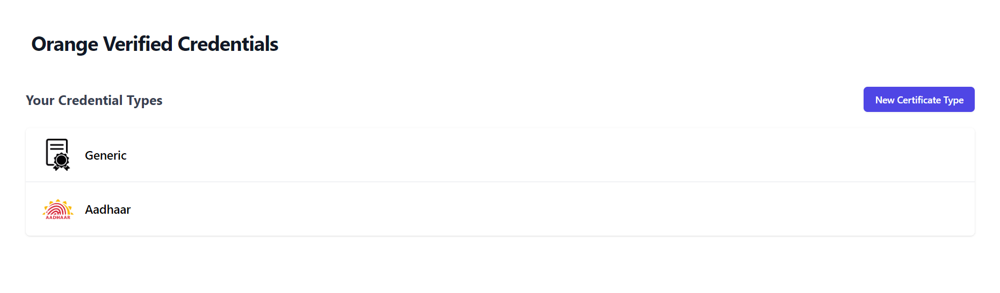
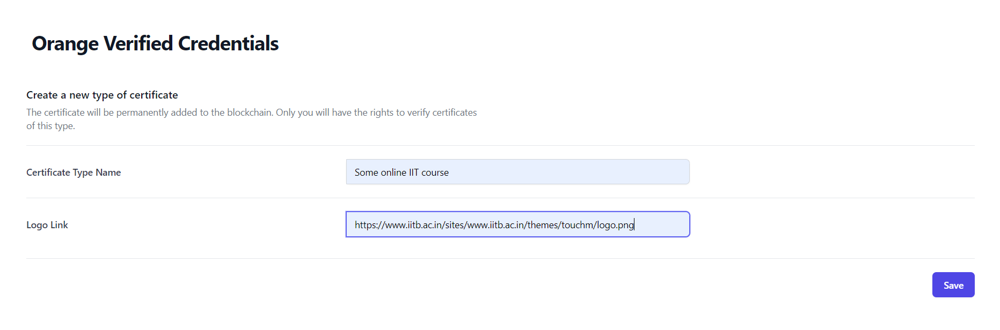
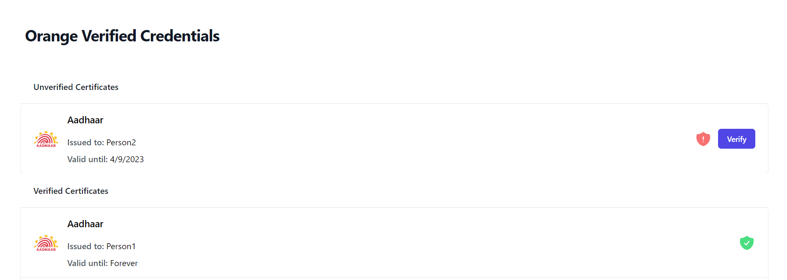

# For Certificate Issuers

## [Open the issuer app](https://issuer.orangify.network/)

Note: The issuer app requires metamask to run. Use the network `http://35.200.223.170:8545/` for the private blockchain.

## Features

- **Avoid Forgery**: only you can verify certificates created by you. This is enforced using asymmetric key cryptography in a private blockchain system.
- **Decentralized**: avoid storing credentials on single servers or databases, which can be tampered or can get corrupted. With your participation in the private blockchain system, you can ensure its working.
- **Single Verification**: once verified digitally, all third-parties can trust them without having to reach out to you to verify them.
- **Easy Revocation**: a blockchain system does not mean that certificates are permanently verified. Any certificate can be revoked at any time, with the operation being recorded on the chain.

## App

### View all credential types owned by you

### Create a new certificate type

Only you can verify certificates of the new type.

### View, verify and revoke certificates

