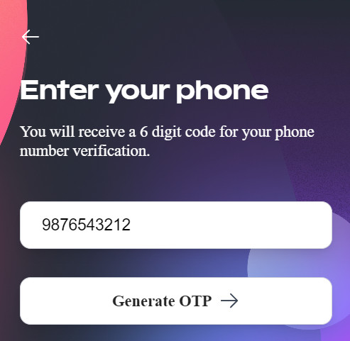
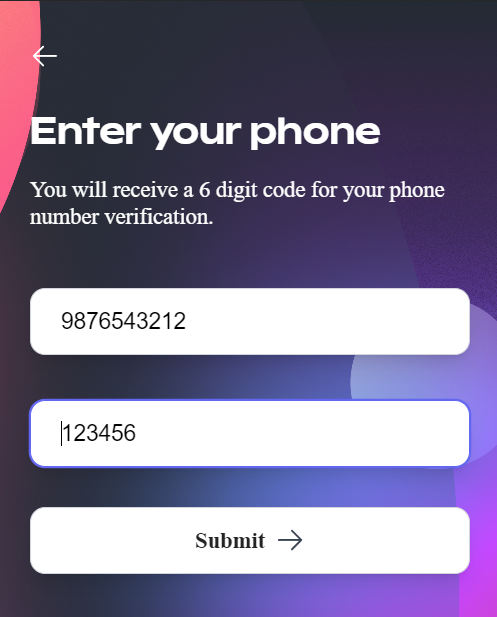
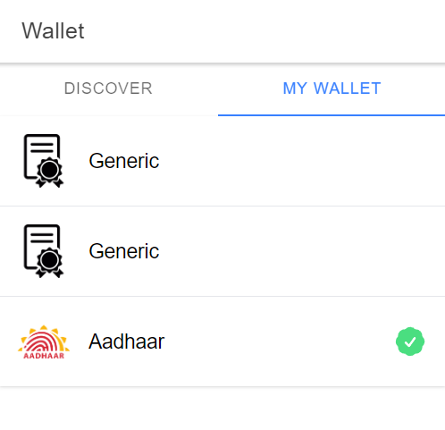
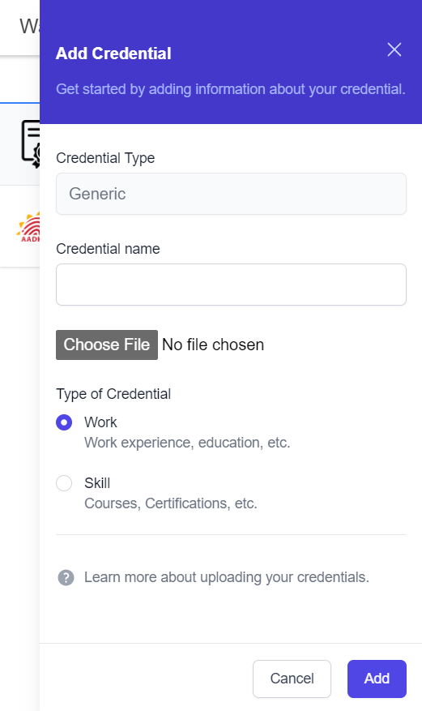
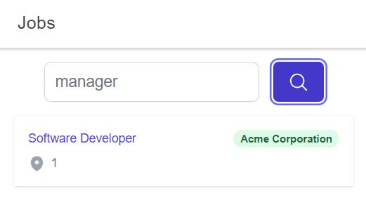
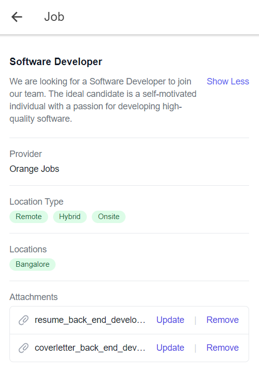

# For end-users

<!-- manage your digital credentials -->
## [Open the app](https://app.orangify.network/) (mobile only)

## Features

- **All certificates in one place**: no need to carry or scan a dozen different papers.
- **Digitally verified**: verification can only be done by the issuing organization - easy to trust the certificates.
- **Easy application**: apply to jobs on **Beckn DSEP** without uploading a single document. All your work history and skills can be selected right through the app.
- **Upload your own**: for any organizations not on the platform, you can upload images of the certificates yourselves.
- **Decentralized**: your certificates are not stored on any single server. The private blockchain system ensures that all issuers have a stake in the system.

## App

### Sign up

Orangify uses phone number + OTP verification for signing in or up.

### Wallet

When you first log in to the Orangify app, you will see all the types of certificates that are available to you. These may include academic certificates, professional licenses, and other important documents. This is your **Wallet** - all your certificates in one place.

### Add Certificate

If you have a certificate that is not already listed in Orangify, you can easily upload it by selecting any of the available certificate types. Once uploaded, your certificate will be added to your collection and you can view it anytime you need to.

### Search for jobs

Using the built-in job search, which makes use of Beckn DSEP APIs, you can find jobs across the whole Beckn network.

### Apply for a job using verified credentials

Click on a job to find more information about it. If it sounds like a job for you, apply for it instantly by selecting the certificates relevant to the posting. Apply for it within seconds.

<!-- Orangify also allows you to view any certificates that have been issued to you by organizations. These certificates will be marked with the issuing organization's name, as well as the date the certificate was issued. You can view the details of each certificate, including any qualifications or achievements that are associated with it. -->

## Source code

[On GitHub](https://github.com/NaikAayush/orangify/tree/main/app)
