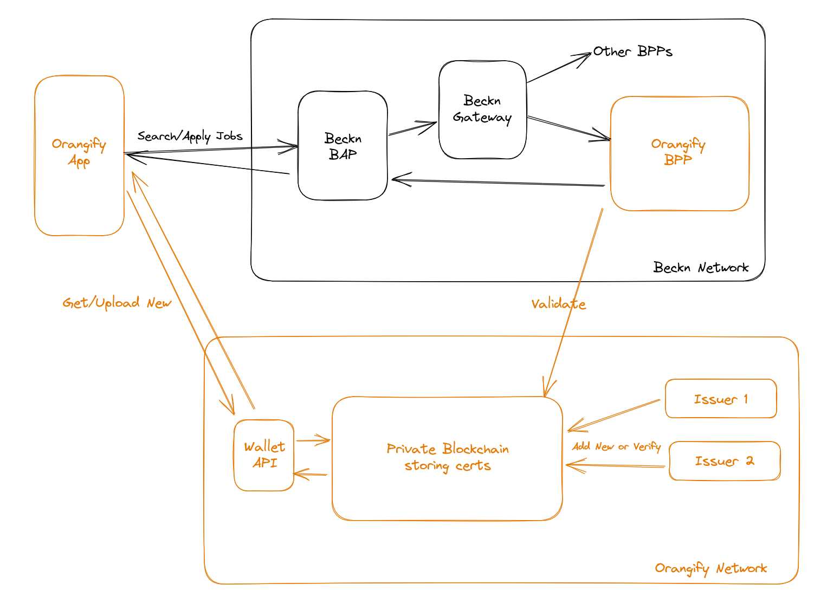
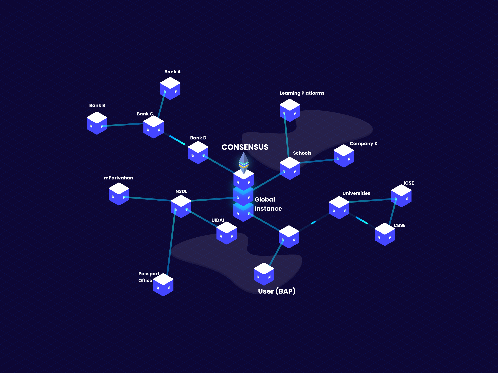

# Architecture and Working

Orangify essentially creates a separate network, away from the Beckn protocol, that is solely dedicated to storing and verifying credentials digitally.

## Components

- [**Orangify App**](for-users.md)
- **Wallet API**: the user application does not interact with the blockchain directly, since that would require creating a crypto wallet. The Wallet API abstracts this and allows users to easily see their certificates and upload new ones.
- **Beckn BAP** and **Beckn Gateway** (along with Beckn Registry, Protocol server and Protocol Client) comprise the parts of the Beckn network that we make use of. None of these are customized.
- [**Orangify BPP**](for-hirers.md): A custom Beckn Provider Platform (BPP) implementation that allows posting Orangify credentials enabled job opening and receiving applications for them.
- [**Issuers**](for-issuers.md): these are organizations issuing the actual verified credentials. They interact with the blockchain directly.
- Private blockchain network: described in the next section.

## Private Blockchain

The private blockchain is powered by [Hyperledger Besu](https://www.hyperledger.org/use/besu), the enterprise-grade permissioned EVM-based blockchain.

Permissioned means that only allowed organizations can participate in the mining of blocks and verification of transaction. This is unlike a public blockchain, such as Ethereum or Polygon, that allows anyone to participate and look at the transactions.

The network of certificate issuers need to come to a consensus, determined by a Consensus Algorithm in Besu, before transactions are confirmed. This makes the data extremely tamper-resistant and fault-tolerant.

We expect the main participants in the network to be certificate issuers such as universities, training institutes, government organizations and NGOs.
